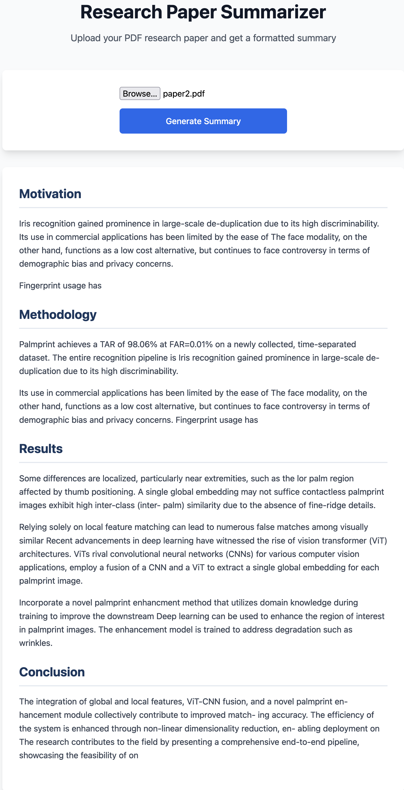

# Research Paper Summarizer

Welcome to the **Research Paper Summarizer** project! This web application allows users to upload research papers (in PDF format) and generates:

- A concise summary of the paper’s content.
- Key topics extracted from the paper.

This tool is built using state-of-the-art Transformer-based models and is designed to help researchers, students, and professionals quickly understand the essence of complex documents.

---

## Features

### 🔄 **End-to-End Workflow**
1. Upload a research paper in PDF format.
2. Extract and summarize the text using a pre-trained Transformer model.
3. View the results in a user-friendly interface.

### 🤖 **Key Technologies**
- **Transformer Models**: Summarization powered by Hugging Face’s `facebook/bart-large-cnn`.
- **PDF Processing**: Seamless text extraction with `pdfplumber`.
- **Web Framework**: Backend built with Flask.
- **Frontend**: A simple HTML-based user interface.

### ✨ **Future Enhancements**
- Topic extraction and Q&A based on the document.
- Export summaries as downloadable files.
- Improved UI design with advanced styling.

---

## Project Structure

```
research-paper-summarizer/
|
├── app.py                      # Main Flask application
├── index.html                  # Frontend HTML file
├── requirements.txt            # Python dependencies
├── uploads/                    # Folder to store uploaded PDFs
│   └── (uploaded files)
├── static/                     # Folder for static assets (CSS/JS)
│   ├── css/
│   │   └── styles.css          # Optional CSS for frontend styling
│   └── js/
│       └── scripts.js          # Optional JavaScript for interactivity
└── utils/                      # Utility functions for modularity
    ├── __init__.py             # Empty file to make it a package
    ├── pdf_extraction.py       # Code for extracting text from PDFs
    └── summarization.py        # Code for text summarization
```

---

## Setup Instructions

### 1. **Clone the Repository**
```bash
git clone https://github.com/your-username/research-paper-summarizer.git
cd research-paper-summarizer
```

### 2. **Install Dependencies**
Install the required Python packages:
```bash
pip install -r requirements.txt
```

### 3. **Run the Application**
Start the Flask server:
```bash
python app.py
```

Open your browser and navigate to `http://127.0.0.1:5000`.

---

## Usage

1. **Upload a Research Paper**: Select a PDF file from your device.
2. **View the Summary**: The app processes the file and displays the summary.
3. **Interact with the Output**: Explore the summarized text and key insights.

---

## Dependencies

- **Flask**: Web framework for Python.
- **Transformers**: Hugging Face library for NLP tasks.
- **Torch**: Deep learning framework.
- **pdfplumber**: PDF text extraction library.

Install them via:
```bash
pip install flask transformers torch pdfplumber
```

---

## Screenshots

### **UI**


---

## Contributing
We welcome contributions! If you have ideas for enhancements or bug fixes:
1. Fork the repository.
2. Create a new branch for your feature.
3. Submit a pull request.

---

## License
This project is licensed under the MIT License. See the `LICENSE` file for details.

---

## Acknowledgments
- Hugging Face for the amazing NLP models.
- OpenAI for guidance and inspiration.

---

## Upcoming Features Checklist

- [ ] Export summarized text to a downloadable file
- [ ] Improved UI with advanced styling
- [ ] Multi-language support for summarization
- [ ] Enhanced PDF parsing for better text extraction

---

Made with ❤️ by Akash Godbole.

